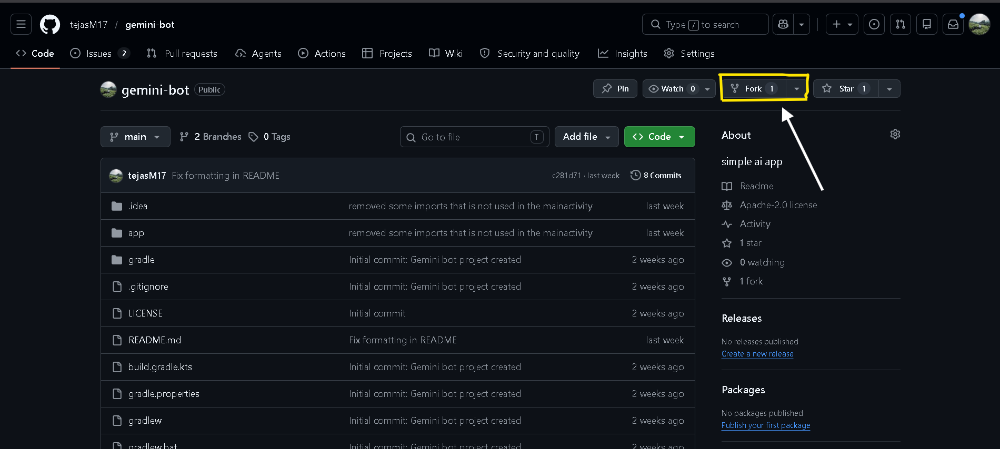

# 🛠 Setup & Installation
---
## 1️⃣ Fork & Clone the Repository



```
git clone https://github.com/username/gemini-bot.git
```
---
## 2️⃣ Open in Android Studio

Open Android Studio

Select Open Existing Project

Choose the gemini-bot folder

test for update branch
